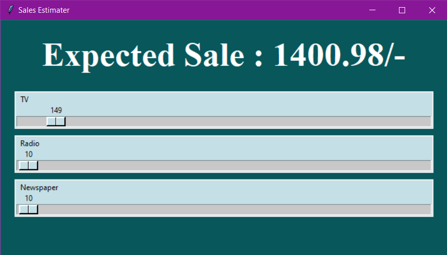

It's a simple Linear Regression project which tries to predict the sales of a company provided how much they are investing in which meadia of advertisement among TV, Radio and Newspaper.
This project is trained on a very [small dataset](advertising.csv) . It's not inteded to be actually used in the market but as a tool to learn from.<br>
The code is avaiable in a Jupyter Notebook format with most of the explanation embedded.<hr>
The trained model is saved using pickle and a GUI using <b>tkinter</b> is implemented.<hr>

The GUI looks like this:

<hr>
The three sliders are used to feed in the data while estimated sales value is displayed in the header area.<br>
Steps to run:<br><b>Method 1:</b>

- Clone the repo using ```git clone https://github.com/Gautam-flash/advertiser.git```
- run Sales_gui.py

<br><b>Method 2:</b>
- Download ```Sales_gui.py``` file
- Download ```model3.sav``` and save it (in the same download directory) in a folder named ```models```
- Run the ```Sales_gui.py``` 

